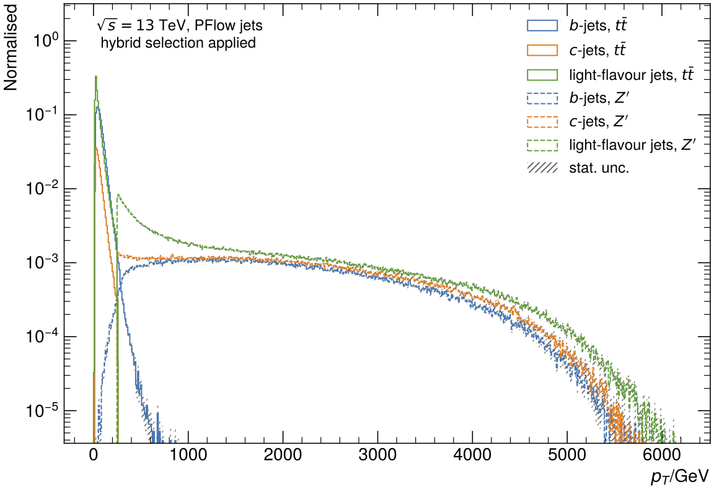
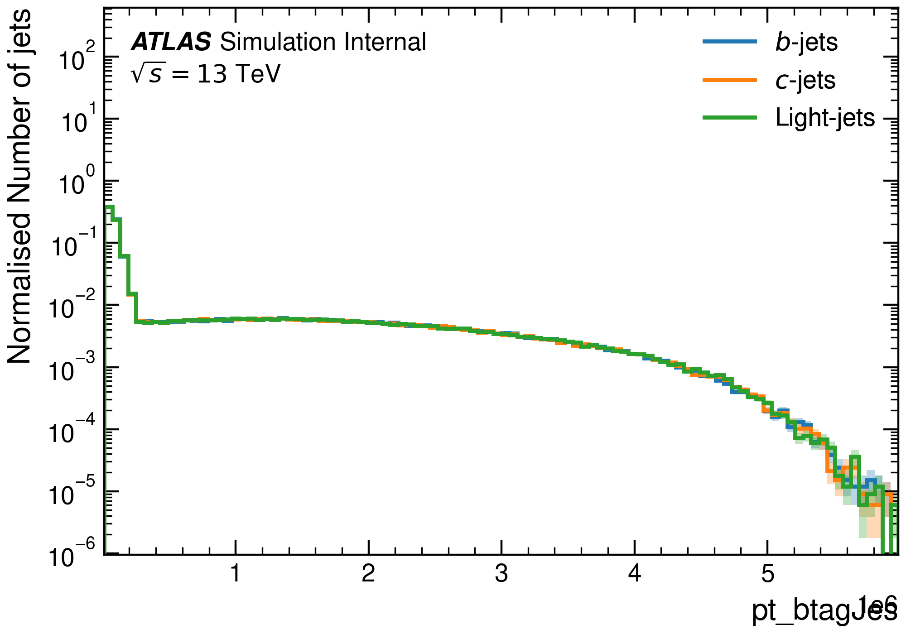

# UPP: Umami Preprocessing 

Welcome to the Umami PreProcessing (UPP) package, a modular preprocessing pipeline for jet tagging.
UPP is used to prepare datasets for training various taggers. 
In particular, it handles hybrid sample creation, resampling, normalisation, and shuffling.

The code is hosted on the Github:

- [https://github.com/umami-hep/umami-preprocessing](https://github.com/umami-hep/umami-preprocessing)

You can find information about tagger training and FTAG software at the central [docs pages](https://ftag.docs.cern.ch/algorithms/GNN/).

???+ info "UPP tutorial"

    A tutorial on how to use the framework is provided at the [central FTAG docs page](update-link)

## Introduction
Input ntuples for the preprocessing are produced using the [training-dataset-dumper](https://gitlab.cern.ch/atlas-flavor-tagging-tools/training-dataset-dumper) which converts from ROOT files to HDF5 ntuples.
A list of available h5 ntuples is maintained in the central [FTAG documentation pages](https://ftag.docs.cern.ch/software/samples/).
However, the ntuples listed there are not directly suitable for algorithm training and require preprocessing (handled by this package).

This library is alredy used to preprocess data for [Salt](https://gitlab.cern.ch/atlas-flavor-tagging-tools/algorithms/salt/) framework.
UPP is planned to be integrated into [Umami](https://gitlab.cern.ch/atlas-flavor-tagging-tools/algorithms/umami) framework for training of Umami/DIPS and DL1r and replace current umami preprocessing, as it addresses [several issues](https://gitlab.cern.ch/atlas-flavor-tagging-tools/algorithms/umami/-/issues/?label_name%5B%5D=Preprocessing) with the current umami preprocessing workflow, and uses the [`atlas-ftag-tools`](https://github.com/umami-hep/atlas-ftag-tools/) package extensively.

## Motivation
The primary motivation behind preprocessing the training samples is to ensure that the distributions of kinematic variables such as $p_T$ and $\eta$ are the same for all flavors.
This uniformity in kinematic distributions is crucial to avoid kinematic biases in the tagging performance.
In order to ensure the uniformity in kinematic distributions, resampling techniques are employed.
These techniques involve removing samples from the majority class (under-sampling) and/or adding more samples from the minority class (over-sampling).

The preprocessing can also be used to control the number of jets of each flavour, to stitch together jets from various samples, and to perform the shuffling and normalisation.

## Hybrid Samples
Umami/DIPS and DL1r are trained on so-called hybrid samples created by combining $t\bar{t}$ and $Z'$ jets using a $p_T$ threshold, which is defined by the `pt_btagJes`.
Below a certain pt threshold (which needs to be defined for the preprocessing), $t\bar{t}$ events are used in the hybrid sample.
Above this pt threshold, the jets are taken from $Z'$ events.
The advantage of these hybrid samples is the availability of sufficient jets with high pt, as the $t\bar{t}$ samples typically have lower-pt jets than those jets from the $Z'$ sample.

The following image show the distributions of jet flavours in both samples

After applying `pdf` resampling with upscaling, we achieve the following combined distributions for jets:

It's worth noting that, while we used $t\bar{t}$ and $Z'$ samples here for illustrative purposes, you can use any type of samples.
Additionally, you're not obligated to create a hybrid sample; UPP can still be used with a single sample for preprocessing.

## This package

Compared with [umami](https://gitlab.cern.ch/atlas-flavor-tagging-tools/algorithms/umami), the main features of this code are:

- modular, class-based design
- use of h5 virtual datasets to wrap the source files
- only 2 main stages: resample -> merge -> done!
- parallelised processing of flavours within a sample, which avoids wasted reads
- support for different resampling "regions", which is useful for generalising to [Xbb preprocessing](https://gitlab.cern.ch/atlas-flavor-tagging-tools/algorithms/umami/-/issues/225)
- n-dim sampling support, which is also useful for Xbb
- "new" improved training file format (which is actually just the tdd output format)
    - structured arrays are smaller on disk and therefore faster to read
    - only one dataloader is needed and can be reused for training and testing
    - other plotting scripts can support a single file format
    - normalisation/concatenation is applied on the fly during training
    - training files can contain supersets of variables used for training
- new "countup" samping which is more efficient than pdf (it uses more the available statistics and reduces duplication of jets)
- the code estimates the number of unique jets for you and saves this number as an attribute in the output file

These features yield the following benefits as compared with umami:

- only one command is needed to generate all preprocessing outputs (running with `--split=all` will produce train/val/test files)
- lines of code are reduced vs umami by 4x
- 10x faster than default umami preprocessing (0.06 vs 0.825 hours/million jets in an old test)
- improvements to output file size and read speed
