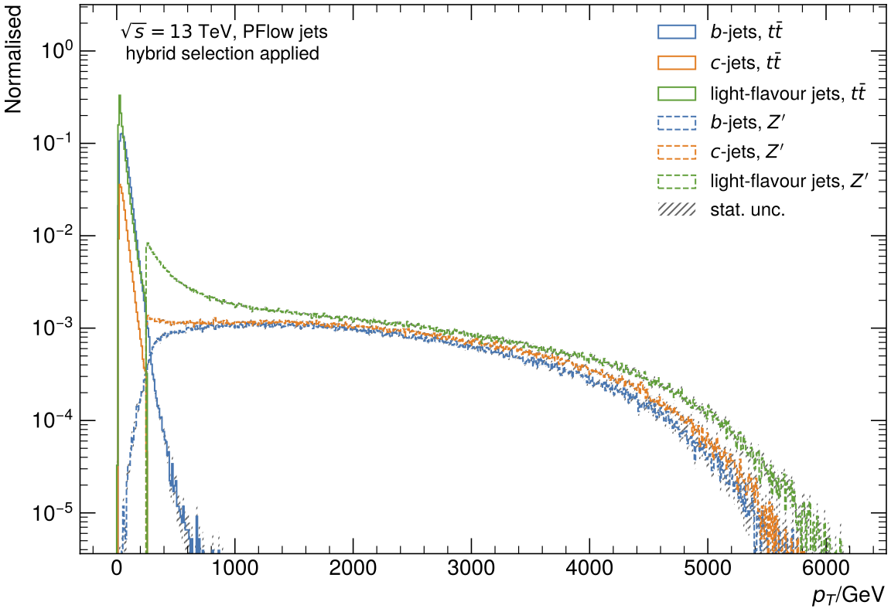
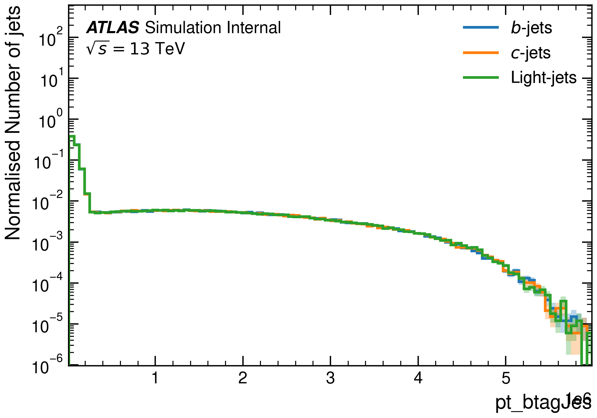

# UPP: Umami Preprocessing 

Welcome to the Umami PreProcessing (UPP) package, a modular preprocessing pipeline for jet tagging.
UPP is used to prepare datasets for training various taggers. 
In particular, it handles hybrid sample creation, resampling, normalisation, and shuffling.

The code is hosted on the Github:

- [https://github.com/umami-hep/umami-preprocessing](https://github.com/umami-hep/umami-preprocessing)

You can find information about tagger training and FTAG software at the central [docs pages](https://ftag.docs.cern.ch/).

???+ info "UPP tutorial"

    A tutorial on how to use the framework is provided at the [central FTAG docs page](https://ftag.docs.cern.ch/software/tutorials/tutorial-upp/)

## Introduction
Input ntuples for the preprocessing are produced using the [training-dataset-dumper](https://gitlab.cern.ch/atlas-flavor-tagging-tools/training-dataset-dumper) which converts from ROOT files to HDF5 ntuples.
A list of available h5 ntuples is maintained in the central [FTAG documentation pages](https://ftag.docs.cern.ch/software/samples/).
However, the ntuples listed there are not directly suitable for algorithm training and require preprocessing. That is what UPP is used for!

This library is already used to preprocess data for the [Salt](https://gitlab.cern.ch/atlas-flavor-tagging-tools/algorithms/salt/) framework.
UPP is [integrated](https://gitlab.cern.ch/aft/algorithms/umami/-/merge_requests/740) into the [Umami](https://gitlab.cern.ch/atlas-flavor-tagging-tools/algorithms/umami) framework used for training Umami/DIPS and DL1r. UPP uses the [`atlas-ftag-tools`](https://github.com/umami-hep/atlas-ftag-tools/) package extensively, which reduces maintenance and streamlines development efforts.

## Motivation
The primary motivation behind preprocessing the training samples is to ensure that the distributions of kinematic variables, such as $p_T$ and $\eta$, are the same for all flavors.
This uniformity in kinematic distributions in training data is crucial to avoid kinematic biases in the tagging performance. It also allows the machine learning model to focus on the less represented jet flavour classes such as b- and c-jets. Resampling techniques are used to achieve this goal. These techniques involve removing samples from the majority class (under-sampling) and/or adding more samples from the minority class (over-sampling).

UPP can also be used to control the number of jets of each flavour in the training data, to stitch together jets from various samples, and to perform shuffling and normalisation of training features.

## Hybrid Samples
Umami/DIPS and DL1r are trained on so-called hybrid samples created by combining $t\bar{t}$ and $Z'$ jets using a $p_T$ threshold.
Below a certain $p_T$ threshold (which needs to be defined for the preprocessing), $t\bar{t}$ events are used in the hybrid sample.
Above this $p_T$ threshold, the jets are taken from $Z'$ events. The `pt_btagJes` variable is used to define if a jet is above or below the $p_T$ threshold.
The advantage of these hybrid samples is the availability of sufficient jets with high $p_T$, as $t\bar{t}$ samples typically have a larger number of low-$p_T$ jets than $Z'$ samples.

The following image shows the distributions of jet flavours in both samples:

After applying `pdf` resampling with upscaling using the UPP framework, we get a training sample with the following combined distributions:

It's worth noting that, while in this example we used $t\bar{t}$ and $Z'$ samples, any samples with different kinematic distributions can be combined using the same method.
Additionally, you're not obligated to create a hybrid sample; UPP can still be used with a single sample for preprocessing.

## This package

The main differences between UPP and the old [Umami](https://umami.docs.cern.ch/preprocessing/Overview/) preprocessing workflow are:

- A modular, class-based design
- The use of h5 virtual datasets to wrap the source files
- Only 2 main stages: resample -> merge -> done!
- Parallelised processing of flavours within a sample, which avoids wasted reads
- Support for different resampling "regions", which is useful for generalising to [Xbb preprocessing](https://gitlab.cern.ch/atlas-flavor-tagging-tools/algorithms/umami/-/issues/225)
- n-dim sampling support, which is also useful for Xbb
- "New" improved training file format (which is actually just the tdd output format)
    - structured arrays are smaller on disk and therefore faster to read
    - only one dataloader is needed and can be reused for training and testing
    - other plotting scripts can support a single file format
    - normalisation/concatenation is applied on the fly during training
    - training files can contain supersets of variables used for training
- New "countup" sampling which is more efficient than pdf (it uses more the available statistics and reduces duplication of jets)
- The code estimates the number of unique jets for you and saves this number as an attribute in the output file

These features yield the following benefits as compared with the old Umami preprocessing:

- Only one command is needed to generate all preprocessing outputs (running with `--split=all` will produce train/val/test files)
- Lines of code are reduced vs Umami by 4x
- 10x faster than default Umami preprocessing (0.06 vs 0.825 hours/million jets in an old test)
- Improvements to output file size and read speed
